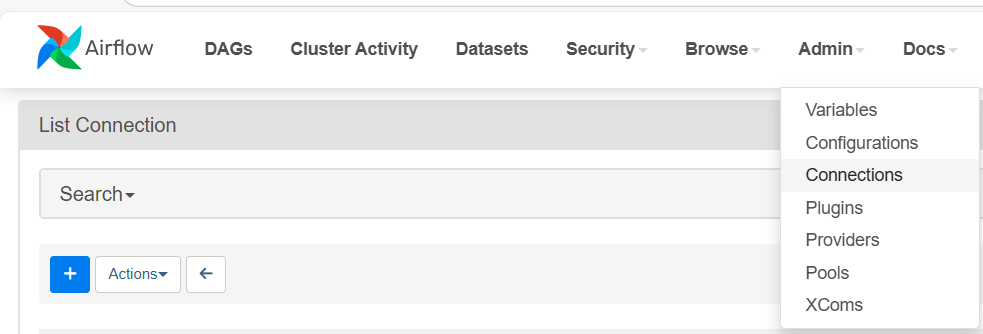

# Цель данного проекта создать dwh.

Описание проекта:
Этот pet-проект моделирует хранилище данных (DWH) c использованием Data Vault 2.0. Данные загружаются из CSV-файлов в Greenplum, затем агрегируются и анализируются.

📁 Структура проекта:
- data
    - categories.csv
    - products.csv
    - customers.csv
    - sales.csv
- sql
    
- scripts
    
README.md

📊 Data Vault 2.0 модель
Проект будет использовать Data Vault 2.0 для хранения и анализа данных
* Хаб-таблицы
* Линк-таблицы
* Сателлит-таблицы

🛠 Технологии
* Greenplum Database (MPP -хранилище)
* PostgreSQL (основа Greenplum)
* Docker (развертывание)
* Python (pandas, facker) (генерация данных)

## Установка и запуск

Устанавливаем Docker 
 запускаем  docker-compose:
    docker compose up
    

# Data Vault 
## структура проекта
    - ods - Слой оперативных данных
        * Данные не очищены и не преобразованы
        * Данные уложены в таблицы стандартных типов
        * Данные обогащены технической информацией (дата загрузки, код источника и т.д.)
        * По необходимости ведется история изменения (SCD2)
    - dds - слой детальных данных
        * Данные источники объединены
        * Данные уложены в одну объектную модель и приведены к DataVault
        * Данные унифицированы
    - ads - слой аналитических данных и витрин
        * Данные уложены в специфические бизнес-модели
        * Набор данных ограничен бизнес-областью
        * Основные назначение - BI-инструменты и отчеты

## Как запустить 
1. Создать схему в базе данных:
    ```sql
    create schema ods;
    create schema dds;
    create schema ads;

## Источники данных
    В качестве источника данных используется система учета продаж ИТ-оборудования. 
    Данные предоставлены в виде CSV-файлов и включают информацию о:
        - заказах
        - клиентах
        - товарах
        - оплатах и поставках

## Подключение к Greenplum через Python в Airflow
    Чтобы подключиться к Greenplum через Python в Airflow, нам нужно:
    1. Установить нужные библиотеки
        pip install apache-airflow[postgres] psycopg2-binary
    2. Создать подключение в Airflow UI
        1. Открываем Airflow web UI (localhost:8080)
        2. Переходим Admin -> Connection
        
        3. Нажимаем + Add
        4. Заполняем так:
            * Conn Id:
            * Conn Type:
            * Host:
            * Schema: 
            * Login:
            * Password:
            * Port: 5432 